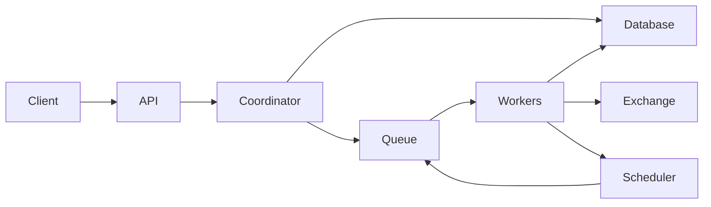
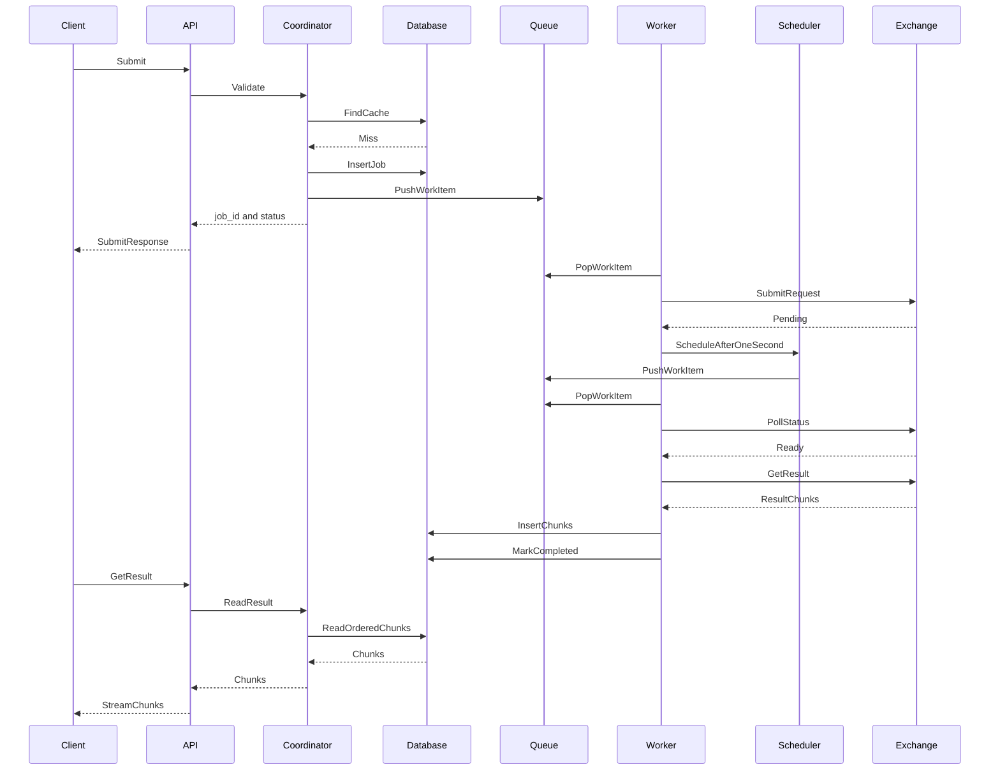
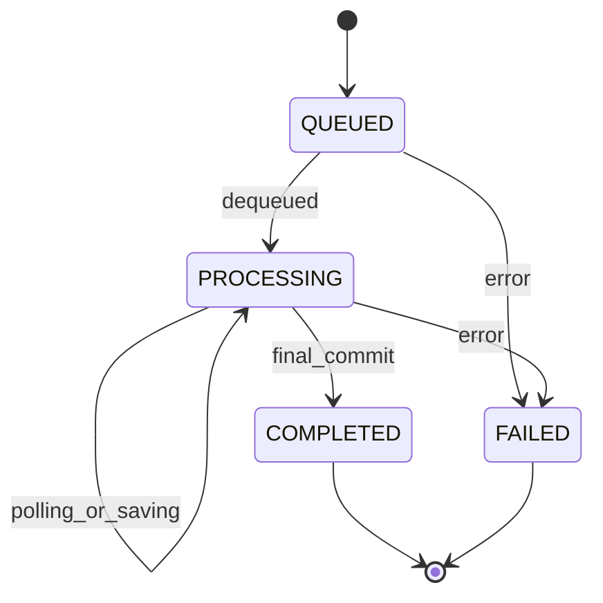
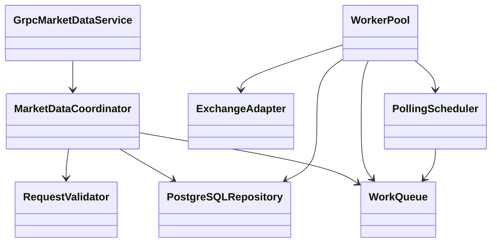

# Architecture Design Report: MarketDataServer

| Поле       | Значение                                                                           |
|------------|------------------------------------------------------------------------------------|
| Статус     | Draft                                                                              |
| Назначение | Веб сервер Market Data для обработки и хранения метаданных финансовых инструментов |
| Стек       | C++23, gRPC, Boost.Asio, Boost.Lockfree, libpqxx, PostgreSQL                       |

## 1. Цель и границы

`MarketDataServer` принимает Bloomberg-like запросы рыночных данных по gRPC и сразу возвращает идентификатор задания. Сервер выполняет запрос к внешнему поставщику, при необходимости опрашивает его до готовности данных, сохраняет ответ в PostgreSQL и отдаёт клиенту результат частями.

Сервер поддерживает только модель request/response и два типа запросов: `ReferenceDataRequest` и `HistoricalDataRequest`. Под Bloomberg-like понимается общая семантика запросов; интеграция с реальным Bloomberg BLPAPI не входит в проект.

API и форматы сообщений определены в [`api/market_data.proto`](api/market_data.proto).

## 2. Архитектурный контекст

Сервер реализуется как модульный монолит. Внешними участниками являются gRPC-клиент, поставщик рыночных данных и PostgreSQL.

Для локальной разработки поставщик и клиент может быть заменён простым эмулятором.

## 3. Компоненты сервера

| Компонент | Ответственность                                                                                                              |
|---|------------------------------------------------------------------------------------------------------------------------------|
| `GrpcMarketDataService` | API: Обслуживает `Submit`, `GetResult` и `Health`, преобразует доменные ошибки в gRPC status и передаёт result chunks клиенту |
| `MarketDataCoordinator` | Coordinator: Координирует валидацию, поиск кэша, создание задания и постановку в очередь                                     |
| `RequestValidator` | Проверяет обязательные поля и допустимость запроса                                                                 |
| `PostgreSQLRepository` | Database: Хранит запросы, задания, статусы, cache key и части ответов                                                        |
| `WorkQueue` | Queue: Инкапсулирует bounded `boost::lockfree::queue<WorkItem>` и backpressure                                               |
| `WorkerPool` | Workers: Забирает задания из очереди и выполняет очередной шаг обработки                                                     |
| `ExchangeAdapter` | Скрывает протокол взаимодействия с поставщиком данных                                                                        |
| `PollingScheduler` | Scheduler: Планирует повторные проверки через `boost::asio::steady_timer`                                                    |

`libpqxx` выполняет блокирующие обращения к PostgreSQL в выделенном пуле DB-потоков и соединений. Потоки gRPC и Boost.asio не должны ожидать базу синхронно.

`WorkItem` содержит только вид операции и `uint64_t JobHandle`, пригодный для lock-free queue. Публичный строковый `job_id`, запросы и ответы остаются в PostgreSQL.

## 4. Хранение данных

Используется одно реальное хранилище — PostgreSQL.

### `jobs`

| Колонка               | Описание                               |
|-----------------------|----------------------------------------|
| `job_handle BIGINT`   | Внутренний идентификатор задания       |
| `job_id UUID`         | Публичный идентификатор задания        |
| `request`             | Исходный запрос                        |
| `status`              | Статус задания                         |
| `cache_key`           | Ключ кэша                              |
| `provider_request_id` | Идентификатор запроса со стороны биржи |
| `error`               | Ошибка обработки                       |
| `timestamps`          | Временные метки                        |

### `response_chunks`

| Колонка         | Описание                                                                                             |
|-----------------|------------------------------------------------------------------------------------------------------|
| `job_handle`    | Внутренний идентификатор задания                                                                     |
| `chunk_no`      | Порядковый номер части ответа                                                                         |
| `payload BYTEA` | Данные с учётом protobuf overhead, чтобы `ResultChunk` был не больше 1 MiB                            |
| Ограничение     | Первичный ключ (`job_handle`, `chunk_no`)                                                             |

Индекс по `cache_key` позволяет до платного обращения к поставщику найти завершённый результат для точно совпадающего запроса. Cache key вычисляется из нормализованного содержимого запроса; технические идентификаторы клиента в него не входят.

Ответ не собирается целиком в памяти. Worker последовательно записывает получаемые chunks с возрастающим `chunk_no`. После успешного завершения upstream-потока отдельная финальная транзакция переводит задание в `COMPLETED`. До этого частичный результат клиенту не выдаётся.

Для `COMPLETED` repository читает `response_chunks` по `chunk_no` и передаёт их в gRPC stream без полной загрузки ответа. Для незавершённого или ошибочного задания `GetResult` отправляет только metadata со статусом, как описано в `.proto`.

## 5. Основной поток

Если очередная проверка снова возвращает `Pending`, шаг с таймером повторяется до готовности, ошибки или общего deadline.

На cache hit новое обращение к поставщику не выполняется: клиент получает идентификатор уже завершённого задания. Если очередь заполнена, `Submit` завершается с `RESOURCE_EXHAUSTED`, а незапущенное задание не остаётся в состоянии `QUEUED`.

### Состояния задания

`COMPLETED` устанавливается только после сохранения всех chunks. При ошибке частично записанные chunks удаляются перед повторным получением результата либо при окончательном переходе в `FAILED`.

## 6. Структура классов

